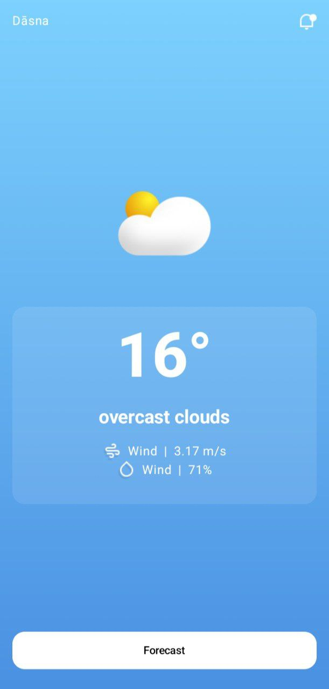
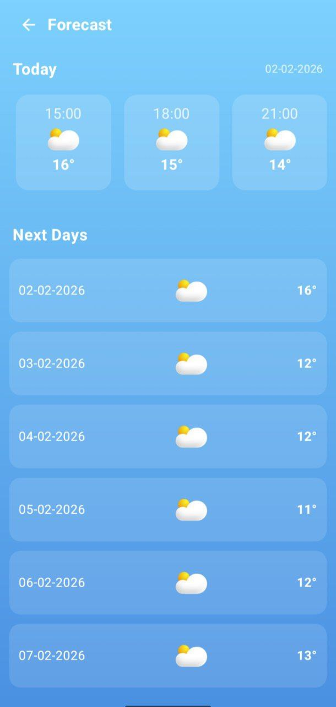

This is a Kotlin Multiplatform project targeting Android, iOS, Web, Desktop (JVM).

* [/composeApp](./composeApp/src) is for code that will be shared across your Compose Multiplatform applications.
  It contains several subfolders:
  - [commonMain](./composeApp/src/commonMain/kotlin) is for code that’s common for all targets.
  - Other folders are for Kotlin code that will be compiled for only the platform indicated in the folder name.
    For example, if you want to use Apple’s CoreCrypto for the iOS part of your Kotlin app,
    the [iosMain](./composeApp/src/iosMain/kotlin) folder would be the right place for such calls.
    Similarly, if you want to edit the Desktop (JVM) specific part, the [jvmMain](./composeApp/src/jvmMain/kotlin)
    folder is the appropriate location.

* [/iosApp](./iosApp/iosApp) contains iOS applications. Even if you’re sharing your UI with Compose Multiplatform,
  you need this entry point for your iOS app. This is also where you should add SwiftUI code for your project.

### Build and Run Android Application

To build and run the development version of the Android app, use the run configuration from the run widget
in your IDE’s toolbar or build it directly from the terminal:
- on macOS/Linux
  ```shell
  ./gradlew :composeApp:assembleDebug
  ```
- on Windows
  ```shell
  .\gradlew.bat :composeApp:assembleDebug
  ```

### Build and Run Desktop (JVM) Application

To build and run the development version of the desktop app, use the run configuration from the run widget
in your IDE’s toolbar or run it directly from the terminal:
- on macOS/Linux
  ```shell
  ./gradlew :composeApp:run
  ```
- on Windows
  ```shell
  .\gradlew.bat :composeApp:run
  ```

### Build and Run Web Application

To build and run the development version of the web app, use the run configuration from the run widget
in your IDE's toolbar or run it directly from the terminal:
- for the Wasm target (faster, modern browsers):
  - on macOS/Linux
    ```shell
    ./gradlew :composeApp:wasmJsBrowserDevelopmentRun
    ```
  - on Windows
    ```shell
    .\gradlew.bat :composeApp:wasmJsBrowserDevelopmentRun
    ```
- for the JS target (slower, supports older browsers):
  - on macOS/Linux
    ```shell
    ./gradlew :composeApp:jsBrowserDevelopmentRun
    ```
  - on Windows
    ```shell
    .\gradlew.bat :composeApp:jsBrowserDevelopmentRun
    ```

### Build and Run iOS Application

To build and run the development version of the iOS app, use the run configuration from the run widget
in your IDE’s toolbar or open the [/iosApp](./iosApp) directory in Xcode and run it from there.

---

Learn more about [Kotlin Multiplatform](https://www.jetbrains.com/help/kotlin-multiplatform-dev/get-started.html),
[Compose Multiplatform](https://github.com/JetBrains/compose-multiplatform/#compose-multiplatform),
[Kotlin/Wasm](https://kotl.in/wasm/)…

We would appreciate your feedback on Compose/Web and Kotlin/Wasm in the public Slack channel [#compose-web](https://slack-chats.kotlinlang.org/c/compose-web).
If you face any issues, please report them on [YouTrack](https://youtrack.jetbrains.com/newIssue?project=CMP).


🌦️ Cross-Platform Weather App

Built with Kotlin & Compose Multiplatform

A modern cross-platform weather application built using Kotlin Multiplatform and Compose Multiplatform, sharing UI and business logic across Android, Web, and iOS from a single codebase.

✨ Why This Project?


Building the same app three times for different platforms leads to duplicated code, higher maintenance, and inconsistent UI.
This project demonstrates how Compose Multiplatform solves that by enabling:

One UI codebase

Shared business logic

Native performance on every platform

🚀 Key Features


🌍 Location-based weather data

☀️ Current weather with daily & weekly forecasts

🧠 Shared ViewModels using MVVM

🎨 Fully shared Compose UI

🔄 State-driven, reactive architecture


🧩 Why Kotlin + Compose Multiplatform?


Kotlin Multiplatform

Shares core logic (networking, data, ViewModels)

Reduces code duplication

Keeps platform-specific flexibility

Compose Multiplatform

Single declarative UI for all platforms

Consistent look and behavior

Native rendering (not WebView-based)


🛠️ Tech Stack


Kotlin Multiplatform

Compose Multiplatform

Coroutines & Flow

MVVM Architecture

moko-geo (location handling)


<div style="display:flex; gap:16px; justify-content:center;">
  
  
</div>

